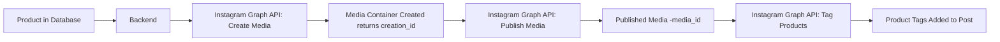

# Publishing product catalog on social media platforms from an Admin Panel

**Problem Statement**: An e-commerce platform stores detailed product information in a database and there is a need to expand the sales channels by automatically publishing these products as posts on an Instagram Business page. Each post should represent a unique product, showcasing its image, name, description, and pricing details, along with a clear call-to-action directing customers to a website where they can complete their purchase.

## Overview

This document will explain in detail the design required to publish products to an Instagram Business page using a backend service. For the sake of this exercise we will assume a UI has been built and displays all the products and gives the user the ability to publish a product using a button.

In this example, we assume each product object has the following fields:

- id
- name
- description
- price
- published (a Boolean flag that indicates whether the product has already been published)
- imageUrl

We'll need two tables to hold information about the product and it's publishing history.

```
model Product {
  id                String           @id @default(cuid())
  name              String
  description       String
  price             Float
  published         Boolean
  imageUrl          String
  publishHistories  PublishHistory[]
}

model PublishHistory {
  id              String   @id @default(cuid())
  productId       String
  product         Product  @relation(fields: [productId], references: [id])
  publishedAt     DateTime @default(now())
  instagramPostId String?
}
```

> **Note** One-to-many relationship: one product can have multiple publish history records. instagramPostId is an optional field to store additional metadata, such as the Instagram post ID



- Your database stores product data.
- The backend queries unpublished products, calls the Instagram Graph API to create and publish posts, and then updates the product record.
- The Instagram Graph API handles media creation and publishing on your Instagram Business page.
- An admin user interface triggers the manual publishing process.

## High Level Design

Let us build this model using the following tech stack

- NodeJS/Express for the backend services
- MongoDB to store the information about the products, Mongoose library to help with the database working
- Assume the UI has been built using React, the UI displays all the available products, there is a button available that will allow a user to publish the product to Instagram.

### Product and PublishHistory Model (Mongoose Schema)

Create a Mongoose model for the Product and PublishHistory.

**Product Schema**

```
const mongoose = require('mongoose');
const Schema = mongoose.Schema;

const ProductSchema = new Schema({
  name: { type: String, required: true },
  description: { type: String },
  price: { type: Number, required: true },
  published: { type: Boolean, default: false },
  imageUrl: { type: String, required: true }
});

module.exports = mongoose.model('Product', ProductSchema);
```

**PublishHistory Schema**

```
const mongoose = require('mongoose');
const Schema = mongoose.Schema;

const PublishHistorySchema = new Schema({
  productId: { type: Schema.Types.ObjectId, ref: 'Product', required: true },
  publishedAt: { type: Date, default: Date.now },
  // Optional: store additional metadata such as Instagram post ID
  instagramPostId: { type: String }
});

module.exports = mongoose.model('PublishHistory', PublishHistorySchema);
```

### Publishing Endpoints in Express

We will have three endpoints, they are

- Create a new product and save the details in DB
- Return all the products to display on the UI
- Return the details of a single product
- Publish a product to Instagram using the Graph API. Update the product’s record in the database (set published: true) and add publish history.

Before we discuss the endpoints required, we should setup the authentication for all these APIs using JWT. This explains how to add JWT authentication middleware to secure your APIs. The idea is to create a middleware that verifies the JWT from the request header, and then apply that middleware to your routes.

Create a file `middleware/auth.js` and use the following contents

```
const jwt = require('jsonwebtoken');

function authMiddleware(req, res, next) {
  const authHeader = req.headers.authorization;
  if (!authHeader) {
    return res.status(401).json({ message: 'Missing authorization header' });
  }

  const token = authHeader.split(' ')[1];

  if (!token) {
    return res.status(401).json({ message: 'Invalid authorization header format' });
  }

  jwt.verify(token, process.env.JWT_SECRET, (err, decoded) => {
    if (err) {
      return res.status(401).json({ message: 'Unauthorized: Invalid token' });
    }
    req.user = decoded;
    next();
  });
}

module.exports = authMiddleware;
```

we can then use the middleware in all the APIs like this

```
app.use('/api/products', authMiddleware, (req,res) => {
  /* Business Logic */
});
```

#### 1. Create a new product and save the details in DB

`POST /api/products`

Request Body

```
{
  "name": "Cool Sneakers",
  "description": "A pair of stylish sneakers.",
  "price": 79.99,
  "imageUrl": "https://example.com/images/sneakers.jpg"
}
```

Response Body

```
{
  "_id": "62d0f23c3a1f3c0012345678",
  "name": "Cool Sneakers",
  "description": "A pair of stylish sneakers.",
  "price": 79.99,
  "imageUrl": "https://example.com/images/sneakers.jpg",
  "published": false,
  "__v": 0
}
```

Express/Node with Mongoose code

```
const express = require('express');
const router = express.Router();
const Product = require('../models/product');

router.post('/product', async (req, res) => {
  try {
    const { name, description, price, imageUrl } = req.body;
    const product = new Product({
      name,
      description,
      price,
      imageUrl
    });
    const savedProduct = await product.save();
    res.status(201).json(savedProduct);
  } catch (error) {
    res.status(500).json({ error: error.message });
  }
});

module.exports = router;
```

#### 2.Return all the products to display on the UI

`GET /api/products`

Response Body

```
[
  {
    "_id": "62d0f23c3a1f3c0012345678",
    "name": "Cool Sneakers",
    "description": "A pair of stylish sneakers.",
    "price": 79.99,
    "imageUrl": "https://example.com/images/sneakers.jpg",
    "published": false,
    "__v": 0
  },
  {
    "_id": "62d0f45d3a1f3c0012345679",
    "name": "Leather Jacket",
    "description": "A trendy leather jacket.",
    "price": 199.99,
    "imageUrl": "https://example.com/images/jacket.jpg",
    "published": true,
    "__v": 0
  }
]
```

Express/Node with Mongoose code

```
router.get('/products', async (req, res) => {
  try {
    const products = await Product.find();
    res.json(products);
  } catch (error) {
    res.status(500).json({ error: error.message });
  }
});
```

#### 3. Return the details of a single product

`GET /api/products/:id`

Request Param `:id`

Response Body

```
  {
    "_id": "62d0f45d3a1f3c0012345679",
    "name": "Leather Jacket",
    "description": "A trendy leather jacket.",
    "price": 199.99,
    "imageUrl": "https://example.com/images/jacket.jpg",
    "published": true,
    "__v": 0
  }
```

Express/Node with Mongoose code

```
router.get('/products/:id', async (req, res) => {
  try {
    const product = await Product.findById(req.params.id);
    res.status(200).json(products);
  } catch (error) {
    res.status(500).json({ error: error.message });
  }
});
```

#### 4. Publish to Instagram

`POST /api/products/:id/publish`

Request Param `:id`

Response Body

```
{
  "message": "Product published successfully",
  "instagramPost": {
    "id": "17912345678901234"
  }
}
```

```
const express = require('express');
const axios = require('axios');
const Product = require('../models/Product');
const router = express.Router();

async function publishProductToInstagram(product) {
  const igUserId = process.env.IG_USER_ID;
  const accessToken = process.env.IG_ACCESS_TOKEN;

  const createResponse = await axios.post(`https://graph.facebook.com/v15.0/${igUserId}/media`, null, {
    params: {
      image_url: product.imageUrl,
      caption: `Check out ${product.name} for just $${product.price}!\n${product.description}\nShop now: https://yourwebsite.com/product/${product._id}`,
      access_token: accessToken
    }
  });

  const creationId = createResponse.data.id;

  const publishResponse = await axios.post(`https://graph.facebook.com/v15.0/${igUserId}/media_publish`, null, {
    params: {
      creation_id: creationId,
      access_token: accessToken
    }
  });

  return publishResponse.data;
}

async function tagProductOnMedia(mediaId, productId) {
  const accessToken = process.env.IG_ACCESS_TOKEN;

  const productTag = {
    product_id: productId,
    position: { x: 0.5, y: 0.5 }
  };

  // Call the API to add product tags to the media
  const response = await axios.post(
    `https://graph.facebook.com/v15.0/${mediaId}/tags`,
    null,
    {
      params: {
        product_tags: JSON.stringify([productTag]),
        access_token: accessToken
      }
    }
  );

  return response.data;
}

router.post('/publish/:id', async (req, res) => {
  try {
    const product = await Product.findById(req.params.id);
    const publishedMedia = await publishProductToInstagram(product);
    const mediaId = publishedMedia.id;
    const tagResponse = await tagProductOnMedia(mediaId, productCatalogId);

    product.published = true;
    await product.save();

    res.status(200).json({ message: 'Product published successfully' });
  } catch (error) {
    console.error('Publishing error:', error);
    res.status(500).json({ error: error.message });
  }
});

router.post('products/:id/publish', async (req, res) => {
  try {
    const product = await Product.findById(req.params.id);
    if (!product) {
      return res.status(404).json({ error: 'Product not found' });
    }

    const publishedMedia = await publishProductToInstagram(product);
    const mediaId = publishedMedia.id;
    const tagResponse = await tagProductOnMedia(mediaId, productCatalogId);

    product.published = true;
    await product.save();

    const publishHistory = new PublishHistory({
      productId: product._id,
      instagramPostId: instagramResponse.id
    });
    await publishHistory.save();

    res.status(200).json({
      message: 'Product published successfully',
      instagramPost: instagramResponse
    });
  } catch (error) {
    console.error('Error publishing product:', error);
    res.status(500).json({ error: error.message });
  }
});

module.exports = router;
```

#### Non Technical formalities that need to done to setup the marketplace

**Instagram Shopping Requirement**: Your Instagram Business account must be approved for Instagram Shopping, and it must have a connected product catalog (via Facebook Commerce Manager).

**Current API Limitations**: As of now, Instagram’s Content Publishing API mainly supports creating and publishing media. While the API exposes a product tagging edge for media objects, programmatically adding product tags to organic feed posts is only available for accounts approved for Instagram Shopping. Some functionality may also be limited to ads or story posts.

**Instagram Shopping Integration**

Convert to an Instagram Business or Creator Account:

- Ensure your Instagram account is set up as a Business or Creator account.

Link to a Facebook Page & Create a Product Catalog:

- Connect your Instagram account to a Facebook Page.
- Use Facebook Commerce Manager to create a product catalog. This catalog will contain all your products (name, description, price, image URL, etc.).

Get Approved for Instagram Shopping:

- Submit your account for review through Instagram’s Shopping section in the settings. Once approved, you’ll be able to tag products in your posts.

Tag Products in Your Posts:

- When creating a post (manually or via a supported API or third-party tool), tag the products from your catalog. This allows users to tap on the tags and view product details.
- Note: While you can automate posting using the Instagram Graph API, adding product tags via API is a more advanced integration and might require using additional Facebook Marketing APIs.

#### How to nvaigate to your website

When using the Instagram API to tag products, you don’t directly specify a clickable URL in the tagging call. Instead, the process works through Instagram Shopping’s product catalog system. Here’s how it works:

**Product Catalog Setup**: You create a product catalog in Facebook Commerce Manager. Each product in this catalog includes details like the product name, image, and—most importantly—a URL that directs users to your website’s product page.

**Tagging a Product**: When you tag a product on an Instagram post via the API, you reference the product’s ID from your product catalog. Instagram then automatically associates the catalog information (including the URL) with that tag.

**User Experience**: When a user taps on the product tag, Instagram displays a product detail overlay that pulls data from your catalog. This overlay typically includes a “View on Website” or similar call-to-action, which uses the URL stored in your catalog.

#### Summary of Steps

Set Up the Database:

- Create a Product and PublishHistory model in MongoDB (using Mongoose).

Build the Backend:

- Develop Express endpoints that performs create and read operations on products.
- For each product, use the Instagram Graph API to create and publish a media container.
- Update the product record after successful publishing.

Instagram API Integration:

- Ensure your Instagram Business account is set up and linked to a Facebook Page.
- Create a Facebook App, configure Instagram Graph API permissions, and generate a long-lived access token.
- Use the two-step API process: first, create the media container; then publish it.

Deployment:

- Host your Node.js/Express backend.
- Ensure your MongoDB instance is accessible.
- Secure your access tokens using environment variables.
