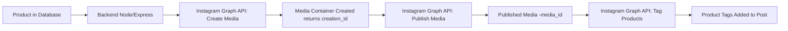

## Publishing product catalog on social media platforms from an Admin Panel

**Problem Statement**: Our e-commerce platform stores detailed product information in a database and we need to expand our sales channels by automatically publishing these products as posts on our Instagram Business page. Each post should represent a unique product, showcasing its image, name, description, and pricing details, along with a clear call-to-action directing customers to our website where they can complete their purchase.

#### Overview

This document will explain in detail the design required to publish products to an Instagram Business page using a Node.js/Express backend. In this example, we assume each product has the following fields:

- id
- name
- description
- price
- published (a Boolean flag that indicates whether the product has already been published)
- imageUrl (since Instagram posts need an image URL)



- A: Your MongoDB stores product data.
- B: The Express/Node.js backend queries unpublished products, calls the Instagram Graph API to create and publish posts, and then updates the product record.
- C: The Instagram Graph API handles media creation and publishing on your Instagram Business page.
- D: An admin interface (or automated scheduled task) triggers the publishing process.

#### High Level Design

#### Product Model (Mongoose Schema)

Create a Mongoose model for the Product. If you need an image for Instagram posts, add an optional imageUrl field.

```
const mongoose = require('mongoose');

const ProductSchema = new mongoose.Schema({
  name: { type: String, required: true },
  description: String,
  price: Number,
  published: { type: Boolean, default: false },
  imageUrl: String
});

module.exports = mongoose.model('Product', ProductSchema);
```

#### Publishing Endpoint in Express

Create an endpoint (or scheduled job) that will:

- Publish it to Instagram using the Graph API.
- Update the product’s record in the database (set published: true).

```
const express = require('express');
const axios = require('axios');
const Product = require('../models/Product');
const router = express.Router();

async function publishProductToInstagram(product) {
  const igUserId = process.env.IG_USER_ID;
  const accessToken = process.env.IG_ACCESS_TOKEN;

  const createResponse = await axios.post(`https://graph.facebook.com/v15.0/${igUserId}/media`, null, {
    params: {
      image_url: product.imageUrl,
      caption: `Check out ${product.name} for just $${product.price}!\n${product.description}\nShop now: https://yourwebsite.com/product/${product._id}`,
      access_token: accessToken
    }
  });

  const creationId = createResponse.data.id;

  const publishResponse = await axios.post(`https://graph.facebook.com/v15.0/${igUserId}/media_publish`, null, {
    params: {
      creation_id: creationId,
      access_token: accessToken
    }
  });

  return publishResponse.data;
}

async function tagProductOnMedia(mediaId, productId) {
  const accessToken = process.env.IG_ACCESS_TOKEN;

  const productTag = {
    product_id: productId,
    position: { x: 0.5, y: 0.5 }
  };

  // Call the API to add product tags to the media
  const response = await axios.post(
    `https://graph.facebook.com/v15.0/${mediaId}/tags`,
    null,
    {
      params: {
        product_tags: JSON.stringify([productTag]),
        access_token: accessToken
      }
    }
  );

  return response.data;
}

router.post('/publish/:id', async (req, res) => {
  try {
    const product = await Product.findById(req.params.id);
    const publishedMedia = await publishProductToInstagram(product);
    const mediaId = publishedMedia.id;
    const tagResponse = await tagProductOnMedia(mediaId, productCatalogId);

    product.published = true;
    await product.save();

    res.status(200).json({ message: 'Product published successfully' });
  } catch (error) {
    console.error('Publishing error:', error);
    res.status(500).json({ error: error.message });
  }
});

module.exports = router;
```

#### Non Technical formalities that need to done to setup the marketplace

**Instagram Shopping Requirement**: Your Instagram Business account must be approved for Instagram Shopping, and it must have a connected product catalog (via Facebook Commerce Manager).

**Current API Limitations**: As of now, Instagram’s Content Publishing API mainly supports creating and publishing media. While the API exposes a product tagging edge for media objects, programmatically adding product tags to organic feed posts is only available for accounts approved for Instagram Shopping. Some functionality may also be limited to ads or story posts.

**Instagram Shopping Integration**

Convert to an Instagram Business or Creator Account:

- Ensure your Instagram account is set up as a Business or Creator account.

Link to a Facebook Page & Create a Product Catalog:

- Connect your Instagram account to a Facebook Page.
- Use Facebook Commerce Manager to create a product catalog. This catalog will contain all your products (name, description, price, image URL, etc.).

Get Approved for Instagram Shopping:

- Submit your account for review through Instagram’s Shopping section in the settings. Once approved, you’ll be able to tag products in your posts.

Tag Products in Your Posts:

- When creating a post (manually or via a supported API or third-party tool), tag the products from your catalog. This allows users to tap on the tags and view product details.
- Note: While you can automate posting using the Instagram Graph API, adding product tags via API is a more advanced integration and might require using additional Facebook Marketing APIs.

#### Summary of Steps

Set Up the Database:

- Create a Product model in MongoDB (using Mongoose).

Build the Backend:

- Develop an Express endpoint that queries unpublished products.
- For each product, use the Instagram Graph API to create and publish a media container.
- Update the product record after successful publishing.

Instagram API Integration:

- Ensure your Instagram Business account is set up and linked to a Facebook Page.
- Create a Facebook App, configure Instagram Graph API permissions, and generate a long-lived access token.
- Use the two-step API process: first, create the media container; then publish it.

Deployment:

- Host your Node.js/Express backend.
- Ensure your MongoDB instance is accessible.
- Secure your access tokens using environment variables.
